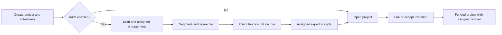

# Workflows and Permissions

Status: target specification. Existing behavior and defects are described in [the analysis](01-current-state-and-defects.md). The policies here resolve migration behavior and take precedence over contradictory legacy UI controls.

## Actors and authority

The server obtains the actor from a verified bearer token and a current active account. Client-supplied IDs identify a resource or intended recipient; they never establish the actor.

| Actor | Permitted responsibilities | Boundaries |
| --- | --- | --- |
| Client | Own projects; hire workers; fund own wallet/escrow; review deliverables; negotiate audits; raise disputes; request termination | Cannot edit another client's work or arbitrate a dispute |
| Worker | Browse open projects; submit proposals; accept own invitations; deliver assigned milestones; own wallet; raise disputes; request termination | Cannot assign themselves through a task PATCH or approve payment |
| Expert | Review assigned engagements; negotiate fees; submit reports; arbitrate assigned disputes | Cannot read all expert engagements or release a normal client approval payment |
| Superuser | User/status administration; operational project oversight; explicit project creation on a client's behalf; wallet operations authorized by existing operations policy | No automatic revenue/intake permissions; no expert impersonation or dispute verdict submission |
| Revenue admin | Financial aggregates and fee configuration | Cannot move another user's wallet or approve expert applications |
| Intake admin | Review applications; read their résumé/certificate attachments; approve/reject applications | Cannot read unrelated project attachments or change fees |
| Compliance admin | Read oversight records, audit logs, application records, and permitted financial analytics | Cannot perform business mutations; changing its own profile is not an oversight operation |
| Anonymous visitor | Landing, login, client/worker signup, expert application/status, application upload | No project/private collection access |

Public worker/expert directories expose only the profile information necessary for discovery. Private account, contact, wallet, and application information requires a separate authorized projection. Navigation mirrors permissions; backend authorization remains decisive.

## Project creation and hiring

1. A client creates a project and its initial budgeted milestones in one operation. Milestone budgets must equal the project budget in paise.
2. Without technical audit, the project becomes `open`. With technical audit, it becomes `draft` and creates an engagement for the selected eligible expert.
3. The client and assigned expert negotiate an audit fee. One party offers; the other accepts. Only the owning client can fund it.
4. After funding, the assigned expert accepts the engagement and the draft becomes open. Changing project status manually cannot bypass this gate.
5. A worker submits a proposal, or the client invites a worker. Hiring/acceptance validates the project's open state, the parties, and available client funds.
6. Hiring funds project escrow and applicable fees, assigns the worker, updates proposal outcomes, and assigns milestone recipients atomically.

Missing projects, invalid reviewers, invalid milestone totals, and insufficient funds must leave no partially created or assigned engagement. Operations project creation uses an explicit on-behalf endpoint with a real selected client, not a forged client identity.

## Deliverables and technical reports

- Only the assigned worker submits or updates work for a milestone. Its project and milestone IDs must match.
- Submission records validated text, links, and authorized file references. It moves eligible work to `submitted`; malformed or empty submissions must not masquerade as finished work.
- An audited project notifies its assigned reviewer, not every expert. Reports are keyed by engagement and milestone, so another milestone's report cannot satisfy coverage.
- Preserve once-per-milestone technical coverage. A resubmission does not automatically create another audit fee or clear an existing report. Display submission/report dates so a client knows when the report predates revisions.
- Client approval requires a submitted/reviewable milestone, no active dispute, sufficient escrow, and an exact-milestone report if audit is enabled. The report is advisory: its presence enables informed acceptance, not automatic payment.
- Approval releases the milestone once, updates progress, and completes the project only when its work is complete. Repeated approval never pays twice.
- A normal revision request keeps funds held and returns work to `revision-needed`; the worker can revise and resubmit.
- Project audit fees remain held until all applicable milestones have reports, except termination follows the refund rule below. Re-filing a report cannot pay an expert twice.

## Disputes and rework

A project party raises a dispute against its actual milestone. Freeze the disputed milestone's payout. Validate the reviewer before opening a dispute-audit engagement; negotiate/fund that engagement through the expert workflow. Only its assigned, eligible reviewer may submit the verdict.

| Verdict | Financial effect | Work effect |
| --- | --- | --- |
| `client-favour` | Keep disputed milestone money in escrow | Resolve the dispute; mark work `revision-needed`; worker revises and resubmits |
| `worker-favour` | Pay the disputed milestone once, net of existing worker fees | Mark milestone complete; remaining project work continues |
| `split` | Pay half the milestone's gross value to the worker and refund the remainder; allocate odd paise deterministically to the client | Close that milestone as settled; remaining work continues |

If the worker declines further work, either party can request termination. A client may also request termination after a worker-favour verdict. Paid work is retained; unused escrow is refunded after pending work is settled. Do not rewrite a binding verdict to manufacture a different refund.

Verdict, money movement, milestone status, and project rollup commit together. A failed settlement leaves the dispute unresolved and funds unchanged. Repeating a resolved verdict returns the recorded result without moving money; attempting a different verdict is a conflict.

## Termination

1. Either project party requests termination with a reason. Operations may administer cancellation under its explicit policy. Record the request on the project and notify its parties.
2. Block new proposals, hiring, milestone creation, and new submissions. Submitted work still needs client acceptance or a dispute verdict; active disputes must still be arbitrated.
3. Return the blocking submitted milestone and active dispute IDs. Keep the project pending if either set is nonempty. Do not auto-approve, auto-refund submitted work, or invent a timeout verdict.
4. Once blockers are settled, cancel remaining unpaid/unsubmitted or revision-needed milestones. Refund the actual remaining project escrow to the client.
5. Refund all unpaid audit escrow, even if the expert accepted or filed an incomplete project's report. Preserve already paid audit fees. Close unfinished engagements without claiming completed coverage.
6. Mark the project cancelled, retain its records and attachments for the permitted participants/oversight readers, and record settlement once. Reevaluate pending termination after a blocking approval or verdict commits.

Marketplace/initiation fees already earned are not reversed. A budget number alone never establishes a refundable amount. An unfunded open task can be deleted without any money movement. Funded or historically settled projects are cancelled and retained, not deleted to erase history.

## Expert intake, settings, and communication

- Expert applicants upload through the public application endpoint and supply their chosen credentials. Intake can read only the application's linked files.
- Approval creates a valid expert account before marking the application approved. Reject duplicate/conflicting identities and missing credentials; never assign a shared fallback password.
- Supported profile/preferences fields persist and are returned by the server. Account identity fields remain read-only in this migration; status administration is operations-only.
- A message's sender is the actor. Its receiver and project must be an allowed conversation, not arbitrary body fields.
- Notifications come from backend use cases. A user can read/mark only their own notifications. Oversight reads do not grant notification mutation powers.
- Password recovery remains an honest unavailable route because no delivery service exists.

## Money and demo behavior

Use INR only, with two decimal places and deterministic paise arithmetic. Keep project and audit escrow separate. Preserve numeric seed balances/budgets and current numeric fee defaults as nominal INR values; do not convert historical USD values using exchange rates. Deposits/withdrawals remain demonstration ledger operations, not claims of real banking integration.

See [contracts](05-api-and-data-contracts.md) for identifiers and interfaces and [acceptance tests](07-testing-and-acceptance.md) for adversarial and failure scenarios.
