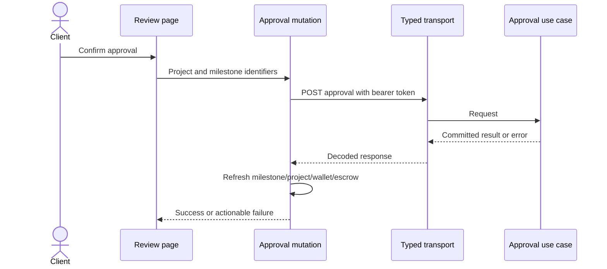

# React Architecture

Status: foundations and marketplace, expert, staff, profile, analytics, and notification flows are implemented; NestJS now serves React. Reports 10 and 14–17 record evidence. The layout below describes architectural responsibilities; actual features often use flat folders rather than unnecessary `pages/components` nesting. See the frontend README for the current code map.

## Stack and principles

Retain React, Vite, React Router, and Lucide. TypeScript, TanStack Query, Vitest, React Testing Library, and Playwright are installed with locked dependencies. Keep Oxlint and add explicit type checking and React hooks lint rules. Use Prettier consistently without running broad formatting over unrelated code.

Organize by business feature. Shared UI should express repeated presentation, while feature components express domain behavior. Keep local state near the components that use it, following [React's component/state guidance](https://react.dev/learn/thinking-in-react). Server state belongs to the query cache, not a duplicate global array store.

## Target layout

```text
front-end-react/src/
  app/
    App.tsx
    providers/                 # Auth and query providers
    routes/                    # Registry, guards, legacy redirects
    layouts/                   # Public and portal shells
    config/                    # API base and environment validation
  features/
    projects/
      pages/
      components/
      api/                     # Project request adapters
      hooks/                   # Query/mutation hooks
      validation/
      types/
      __tests__/
    auth/                      # Same pattern only where needed
    profiles/
    proposals/
    milestones/
    audits/
    disputes/
    wallets/
    messages/
    notifications/
    expert-applications/
    administration/
    analytics/
  shared/
    api/                       # Transport, errors, uploads/downloads
    ui/                        # Buttons, fields, dialogs, tables, states
    types/                     # Public cross-feature contracts
    utils/                     # Currency/date helpers and pure functions
    styles/                    # Tokens, reset, shared shell styles
```

Do not create empty folders to satisfy the tree. Extract a helper when there is a responsibility or real reuse, not merely a line-count threshold. Features import shared code and another feature's deliberate public exports; they must not reach into unrelated feature internals.

## Component boundaries

| Layer | Responsibility | Example |
| --- | --- | --- |
| Page | Compose the route, fetch required data through hooks, choose screen states | `ProjectWorkroomPage` |
| Feature component | Render domain data and collect user intent | `MilestoneCard`, `AuditOfferPanel` |
| Feature hook | Query/mutate through a typed feature API and refresh affected data | `useApproveMilestone` |
| Feature API | Describe endpoint input/output; no navigation or UI state | `approveMilestone` |
| Shared transport | Bearer headers, envelope decoding, error normalization, abort support | `request<T>` |
| Shared UI | Accessible visual controls without project/ledger decisions | `ConfirmDialog`, `EmptyState` |

Reuse one workroom, milestone board, report viewer, and wallet presentation across roles. Supply capabilities from the current actor and server data. Separate a report viewer from expert-only report editing; do not hide both behind a role query parameter.

## Routing and permissions

- One route registry supplies paths, title, layout, allowed roles, navigation labels, and dashboard destinations. Do not maintain independent role tables in App, Sidebar, and auth utilities.
- `/` remains the public landing page. `/dashboard` redirects authenticated users to their role dashboard. A protected route waits for identity validation before redirecting.
- Keep the scaffold's stable role URLs. Use explicit project-and-milestone paths for submission/review; report and audit IDs must identify their actual resource.
- Save the requested internal URL when sending a visitor to login. After login, restore it only if permitted for the validated role; otherwise use the role dashboard.
- Legacy URLs are compatibility inputs. Translate them through the mapping in [the roadmap](06-migration-roadmap.md#legacy-screen-mapping), resolving resource relationships where required.
- Missing/invalid IDs produce an error or not-found screen. Never use the first cached project, a demo user, or a query-string role as a fallback authority.
- Unknown roles fail closed. A forbidden route provides a role-appropriate dashboard link without a redirect loop.

## Authentication and transport

Retain the existing `lannent_token` and `lannent_session` keys for the migration window. Stored session data is display cache only. Restore using the bearer token and `/auth/me`; accept only a real active user. Clear both keys when verification fails or a protected request returns 401. Network failure shows a retry state rather than treating unverified identity as authenticated.

Use `/api` with a Vite development proxy by default. An explicit API URL supports separate origins. Normalize its trailing slash once; never compute file URLs from an unchecked optional environment variable. Send Authorization and appropriate content type; remove session/role/user-id headers from browser requests.

`request<T>` unwraps `{ success, message, data }`, preserves status/request ID in an `ApiError`, handles empty responses, and rejects unsuccessful envelopes. For `FormData`, let the browser set its content type. Downloads fetch authorized bytes and use the server filename; filename-only legacy files display unavailable. Do not embed protected file links as anonymous image requests.

## State and feedback

- Use component state for inputs, expanded rows, filters, and modal visibility. Use a reducer for a multi-step project form.
- Use TanStack Query for actor-scoped collections and details. Include actor identity in private query keys and clear private cache at logout/account switch.
- Fetch only collections needed for a page. Do not bootstrap every domain at login or show an API outage as an empty successful collection.
- Invalidate affected project, milestone, wallet, escrow, audit, and notification queries after successful mutations. This follows [TanStack Query's documented pattern](https://tanstack.com/query/latest/docs/framework/react/guides/invalidations-from-mutations).
- Disable duplicate actions while pending. Do not optimistically mark payment, hiring, approval, or settlement successful. The server decides success.
- Represent loading, empty, unavailable, forbidden, validation, and network failures separately. Preserve draft inputs after failed requests.

## Forms, INR, and styles

Client validation helps users; backend DTOs enforce the contract. Reuse typed field validators, field error rendering, and labels. Display unsupported identity fields read-only, and do not silently submit values the backend discards.

Use one `formatMoney` helper based on `Intl.NumberFormat('en-IN', { style: 'currency', currency: 'INR' })`. INR is not a per-page dropdown. Calculations come from backend values; browser fee previews must never determine settlement.

Extract existing colors, typography, spacing, and shell styles into tokens. Scope feature styles with CSS Modules. Replace large inline style blocks incrementally without redesigning familiar workflows. Shared dialogs require keyboard focus management; fields need associated labels; status feedback must be accessible.

## Worked flow: milestone approval



No component credits a wallet, changes task completion, or fabricates a notification. Tests verify observable behavior rather than reproducing this internal call sequence.
