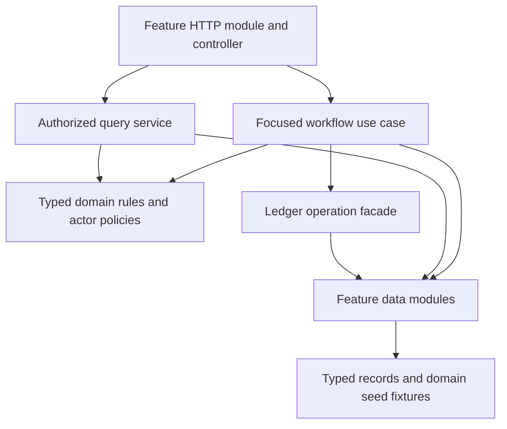

# Backend Architecture

Status: W2 typed records, leaf data modules, acyclic core composition, and ledger operations are implemented; see [structural report](13-w2-structure.md). The remaining feature-level use-case layout below is target architecture. Keep seeded in-memory repositories; no database, ORM, durable queue, or microservice migration is part of this work.

## Existing foundation

Feature modules already separate controller, service, repository, and DTO files. Preserve that familiarity. The problem is cross-feature orchestration: services and modules depend on each other through `forwardRef`, while broad mutable records obscure who is allowed to write which fields.

## Dependency direction



Data modules do not import HTTP modules, use cases, or feature services. Workflow modules import leaf data modules and ledger/security infrastructure, not other feature HTTP modules. Authentication depends on user data rather than on a UsersModule that also imports financial workflows. This direction eliminates circular workflow imports rather than disguising them with additional `forwardRef` calls.

## Feature organization

Keep simple modules simple. Add the following where their responsibilities exist:

```text
modules/<feature>/
  <feature>.module.ts           # HTTP composition
  <feature>.controller.ts       # DTO + actor + operation
  <feature>.core.module.ts      # Service-only dependency composition
  <feature>.data.module.ts      # Repository registration/exports only
  <feature>.repository.ts       # Typed in-memory data access
  <feature>.types.ts            # Domain records and statuses
  dto/                         # Public request/response contracts
  policies/                    # Permission and transition rules
  queries/                     # Authorized read projections
  use-cases/                   # Focused actions when feature-local
workflows/<domain>/             # Multi-feature orchestration
common/                        # Authentication, logging, configuration, UoW
modules/seed/fixtures/          # Feature-specific seed records
```

Do not add four abstract layers around a trivial read. Controllers may call a small authorized query service or a feature-local action directly. Keep existing public service facades small where compatibility is useful; move their orchestration into named operations.

## Workflow responsibilities

| Workflow | Owns | Depends on |
| --- | --- | --- |
| Create project | Actor/client validation; milestone allocation; draft/open state; initial engagement | Project, milestone, audit data and expert eligibility policy |
| Hire worker | Proposal/invitation permissions; funding; assignment; competing proposal outcomes | Project/proposal/milestone data and escrow funding |
| Submit/review milestone | Deliverable relationships; audit gate; revision/approval; progress | Milestone/project/audit data and payout facade |
| Audit engagement | Offers, opposite-party acceptance, funding, expert acceptance, report coverage/payout | Audit/report/project/milestone data and ledger |
| Resolve dispute | Assignment; verdict; funded rework or settlement; project rollup | Dispute/milestone/project data and ledger |
| Terminate project | Request, blockers, remaining escrow refunds, unfinished engagement closure | Project/milestone/dispute/audit data and refunds |
| Approve expert application | Credential/identity validation; account creation; approval record | Application/user/file data |

State transitions and read visibility are pure policies where possible. Use-case input includes a typed actor and identifiers; internal calls must not bypass authorization by omitting a viewer argument.

## Ledger and atomic state

Keep a small ledger facade and delegate implementation to wallet operations, escrow funding, payouts, refunds, and fee calculation. Only ledger operations may mutate balances, escrow, billings, revenue, payout markers, or financial transaction rows. Generic user/profile and transaction controllers cannot write those values.

For coupled mutations, use a synchronous in-memory unit of work:

1. Authenticate, authorize, resolve related records, and validate transitions, amounts, recipients, and available funds.
2. Snapshot participating repository state, counters, and relevant idempotency sets.
3. Perform all state writes within one synchronous operation. Do not await network/file work while holding mutable state.
4. On exception, restore every participant and rethrow a useful error. On success, return the committed result.
5. Emit notifications and ordinary logs after commit. Failure to notify must be visible but must not silently roll back a settled payment.

Repositories return read copies/projections and expose explicit write methods rather than mutable references escaping into unrelated services. Include fee configuration in rollback when an operation changes it. Store idempotent settlement results, not only flags, so a repeated call can return what happened.

This gives operation-level consistency within one process. It does not add restart durability or multi-process transactional guarantees. Document that limit, keep deterministic seed resets, and use disposable data in tests.

INR calculations use integer paise internally. Existing public monetary fields remain rupee amounts with two-decimal precision, converted at boundaries. Preserve existing fee percentages, nominal fixed fee defaults, and tier thresholds; evaluate them consistently in paise. Split settlements give the leftover odd paise to the client.

## Request lifecycle and authorization

Preserve the request ID before access logging. Resolve a verified bearer token to a current active user. A typed `CurrentActor` decorator supplies the actor to controllers. Role checks restrict the class of operation; policy checks restrict the specific record and field.

Public routes are explicit exclusions. Invalid presented credentials fail closed. Browser requests never derive identity from role/session headers. If compatibility tooling remains during migration, isolate its development-only header fallback and retire it at cutover.

Apply viewer policy before client filters, not afterward. Separate directory profiles, own-account data, application records, participant records, and oversight views. Never return password hashes or internal credential records.

## Startup, files, and operations

- Extract environment validation, prefix/pipes/interceptor/filter, CORS/security, Swagger, and static serving setup from bootstrap. Load environment values before constructing token configuration.
- Share application setup with HTTP tests. Production and test harnesses must enforce the same validation and permission boundaries.
- Keep middleware ordering documented and tested. Update stale comments and Swagger examples that still imply arbitrary headers are authoritative.
- Preserve file size/type limits and authenticated byte streaming. Validate task/milestone relationships and file-reference access before attachment.
- Intake file access is application-specific. Referencing an arbitrary project file in an application must not grant intake access to that file.
- File bytes and metadata cannot share an in-memory transaction. Record upload ownership and clean up new files if metadata/attachment creation fails. Do not erase valid financial/history records to compensate for notification or file-download errors.
- Split seed fixtures by feature; keep a seeder that resets repositories and fee configuration in a documented order. Production refuses seed reset.
- Separate revenue query aggregation from fee-setting commands. Compliance can read but cannot mutate fee settings; every permitted fee change records actor and before/after values.

## Comments and review rules

Document a use case's purpose, authorized actor, preconditions, affected stores, idempotency, and failure behavior. Put current financial invariants near the code enforcing them. Remove obsolete historical explanations from source and retain useful history in the defect register.

A refactor is complete only when its public behavior is verified, circular dependencies are removed for the affected workflow, and a new contributor can trace controller → operation → policy/ledger/repositories without needing to infer hidden side effects.
